## Diagram of AI Agent Swarm

```mermaid
graph TD
    %% Input Layer
    subgraph InputLayer["Input Layer"]
        UserInput["User Input"] --> Preprocessing["Preprocessing"]
    end

    %% Distributed Leadership
    subgraph DistributedLeadership["Distributed Leadership"]
        Preprocessing --> CouncilOfAdvisors["Council of Advisors"]
        CouncilOfAdvisors --> Advisors["Advisors (Domain Experts)"]
        Advisors --> OperationalPlanning["Operational Planning"]
        OperationalPlanning --> Nobles["Nobles (Regional Leaders)"]
    end

    %% Lower Leadership (Peasants and Workers)
    subgraph LowerLeadership["Lower Leadership"]
        Nobles --> TaskExecution["Task Execution"]
        TaskExecution --> Workers["Workers (Agents)"]
    end

    %% Self-Optimizing Layer
    subgraph SelfOptimizingLayer["Self-Optimizing Layer"]
        Workers --> LocalAutonomy["Local Autonomy"]
        Workers --> SelfOptimization["Self-Optimization"]
        Workers --> PeerCollaboration["Peer Collaboration"]
    end

    %% Collaborative Decision-Making
    subgraph CollaborativeDecisionMaking["Collaborative Decision-Making"]
        Workers --> PeerToPeer["Peer-to-Peer Communication"]
        Nobles --> VotingMechanisms["Voting Mechanisms"]
        VotingMechanisms --> ConsensusThreshold["Consensus Threshold"]
        VotingMechanisms --> MARLConsensus["MARL Consensus System"]
        Nobles --> BayesianInference["Bayesian Inference"]
    end

    %% Security Layer
    subgraph SecurityLayer["Security Layer"]
        Workers --> ArmyAgents["Army AI Agents"]
        Nobles --> ArmyAgents
        Advisors --> ArmyAgents
        ArmyAgents --> ThreatDetection["Threat Detection"]
        ArmyAgents --> AccessControl["Access Control"]
        ArmyAgents --> IncidentResponse["Incident Response"]
        ArmyAgents --> AdversarialDefense["Adversarial Defense"]
        ThreatDetection --> CouncilOfAdvisors
        AccessControl --> Nobles
        IncidentResponse --> TaskExecution
    end

    %% University System (Dynamic Role Assignment)
    subgraph UniversitySystem["University System"]
        Workers --> University["University System"]
        University --> RoleSpecialization["Role Specialization"]
        University --> ContinuousLearning["Continuous Learning"]
        University --> Mentorship["Mentorship"]
        University --> TrainingGrounds["Training Grounds"]
    end

    %% Scalability Mechanisms
    subgraph ScalabilityMechanisms["Scalability Mechanisms"]
        Workers --> DistributedMemory["Distributed Memory"]
        Nobles --> Sharding["Sharding"]
        Advisors --> LoadBalancing["Load Balancing"]
        LoadBalancing --> ReinforcementLearning["Reinforcement Learning"]
        Workers --> ModelDistillation["Model Distillation"]
        Nobles --> FederatedLearning["Federated Learning"]
        Advisors --> GradientSparsification["Gradient Sparsification"]
        LocalProcessing --> LoadBalancing
        DataSynchronization --> ModelDistillation
    end

    %% Output Layer
    subgraph OutputLayer["Output Layer"]
        Workers --> OutputGeneration["Output Generation"]
        OutputGeneration --> FinalOutput["Final Output"]
    end

    %% Feedback Loop
    subgraph FeedbackLoop["Feedback Loop"]
        FinalOutput --> FeedbackAggregation["Feedback Aggregation"]
        FeedbackAggregation --> Nobles
        Nobles --> Escalation["Escalation to Advisors"]
        Escalation --> Advisors
        Advisors --> CouncilOfAdvisors
    end

    %% Data-Driven Feedback System
    subgraph DataDrivenFeedback["Data-Driven Feedback System"]
        FeedbackAggregation --> HistoricalAnalysis["Historical Analysis"]
        HistoricalAnalysis --> PredictiveModeling["Predictive Modeling"]
        PredictiveModeling --> PolicyUpdates["Policy Updates"]
        PolicyUpdates --> Nobles
        PolicyUpdates --> Advisors
    end

    %% Emergency Channel
    subgraph EmergencyChannel["Emergency Channel"]
        Workers --> EmergencyChannelNode["Emergency Channel"]
        Nobles --> EmergencyChannelNode
        Advisors --> EmergencyChannelNode
        EmergencyChannelNode --> CrisisManagementTier["Crisis Management Tier"]
        CrisisManagementTier --> Nobles
        CrisisManagementTier --> CouncilOfAdvisors
        CrisisManagementTier --> King["King (Facilitator)"]
    end

    %% Dynamic Role of the King
    subgraph DynamicKingRole["Dynamic Role of the King"]
        CouncilOfAdvisors --> King
        King --> Vision["Create Vision"]
        King --> ConflictResolution["Conflict Resolution"]
    end

    %% Ethical Oversight
    subgraph EthicalOversight["Ethical Oversight"]
        Advisors --> EthicsCommittee["Ethics Committee"]
        EthicsCommittee --> BiasAndFairness["Bias & Fairness"]
        EthicsCommittee --> HumanInLoop["Human-in-the-Loop"]
    end

    %% Real-Time Monitoring
    subgraph RealTimeMonitoring["Real-Time Monitoring"]
        Workers --> MonitoringDashboards["Monitoring Dashboards"]
        Nobles --> Alerts["Alerts"]
    end

    %% Disaster Recovery
    subgraph DisasterRecovery["Disaster Recovery"]
        Workers --> BackupNodes["Backup Nodes"]
        Nobles --> FailoverMechanisms["Failover Mechanisms"]
    end

    %% Edge Computing
    subgraph EdgeComputing["Edge Computing"]
        Workers --> LocalProcessing["Local Processing"]
        Nobles --> DataSynchronization["Data Synchronization"]
        Workers --> UncertaintyQuantification["Uncertainty Quantification"]
        Nobles --> ScenarioTesting["Scenario-Based Testing"]
        LocalProcessing --> LoadBalancing
        DataSynchronization --> ModelDistillation
    end
```

The AI Agent Swarm workflow begins by processing user input , which is preprocessed and passed to a distributed leadership hierarchy consisting of the King , Council of Advisors , and Nobles .  
- The King sets the overarching vision, while the Council of Advisors collaborates on strategic decisions, translating the King’s vision into actionable plans.  
- Nobles oversee regional task delegation, ensuring tasks are distributed effectively to Workers for execution.  

At the execution level, Workers operate autonomously using:  

- Local optimization to adapt dynamically to their environment.  
- Peer collaboration to solve problems collectively.  
- Edge computing for localized processing, reducing latency and optimizing resource usage.  

Continuous feedback loops refine decision-making in real-time:

- Feedback from task execution, security monitoring, and historical analysis informs data-driven insights .  
- Mechanisms like federated learning , threat detection , and crisis management tiers ensure scalability , adaptability , and resilience across all levels.  
- Finally, outputs are generated based on task execution, with feedback continuously improving strategies to handle future challenges.  

